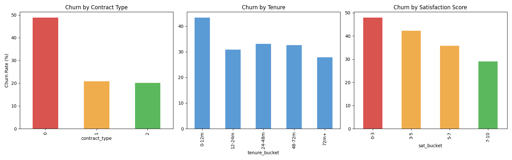
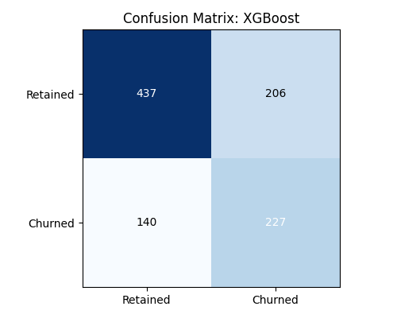
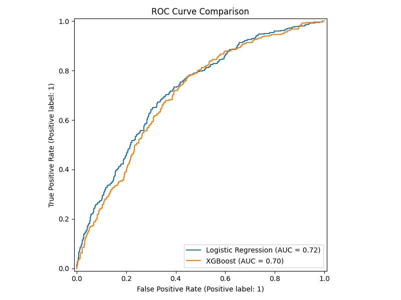
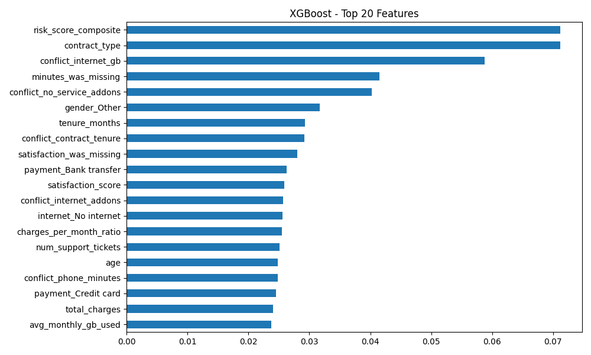

# Retention Agent Evaluation Scorecard & Analysis

🚀 **Live Agent Demo:** [https://aatithya-task.streamlit.app/](https://aatithya-task.streamlit.app/)

This document fulfills Part 2.4 of the assessment. It contains the aggregate evaluation of the AI Agent against the 12-case test suite, along with deep-dive analyses of specific successes and failures, and a production CI/CD roadmap.

*Note: Please run `python run_evaluation.py` to generate `evaluation_scorecard.csv` and populate the exact numbers below.*

## 📋 Deliverables Mapping

| Task No | Task / Subtask | Filepath |
| :--- | :--- | :--- |
| **1** | Jupyter notebook with markdown narrative | `notebooks/Part1_Churn_Analysis.ipynb` |
| **1** | Cleaning code or cleaned dataset | `src/data_processing.py`, `data/cleaned_datafile.csv` |
| **1** | Data quality summary table (before/after) | `src/data_processing.py` |
| **1** | Three or more EDA visualizations with written takeaways | `src/model_building.py`, `evaluation/eda_charts.png` |
| **1** | Two or more models trained, compared, and evaluated | `src/model_building.py` |
| **1 → 2** | Exported model artifact and predict_churn function | `models/*.pkl`, `src/tools.py` |
| **2** | Agent orchestration code with tool definitions | `src/agent.py`, `src/tools.py` |
| **2** | Structured test suite (12+ cases) | `evaluation/test_suite.json` |
| **2** | Automated evaluation metrics | `evaluation/eval_metrics.py` |
| **2** | LLM-as-judge pipeline with anchored scoring rubric | `evaluation/llm_judge.py` |
| **2** | Live demo URL | `src/app.py` (Deployed to Streamlit Cloud) |
| **2** | Results scorecard with success and failure analysis | `evaluation/scorecard_analysis.md`, `evaluation/evaluation_scorecard.csv` |
| **Both** | GitHub repository with commit history and README | `README.md` |

---

## Part 1: Churn Model Analysis & Outcomes

### 1.1 — Data Quality Assessment and Cleaning
Below is the summary table of the systematic data quality corrections applied prior to modeling:

| Column | Issue | Before | After | Cleaning Strategy |
| :--- | :--- | :--- | :--- | :--- |
| `age` | Impossible/missing values | nulls=10 | nulls=0 | Nullified impossible ages (<18, >100), flagged floor values, imputed missing with median. |
| `gender` | Spelling variants, missing data | 8 unique values | OHE applied | Standardized to Male/Female/Other/Unknown, applied one-hot encoding. |
| `total_charges` | Low vs expected billing | Rows off by >70% | Corrected & flagged | Recalculated total charges using monthly charges × tenure where implausibly low (< 30% expected); flagged as suspect. |
| `internet_service` | String nan, variants | ['DSL', 'Fiber optic', 'No', 'fiber', 'dsl'] | OHE applied | Standardized spellings to DSL/Fiber optic/No internet/Unknown, then applied one-hot encoding. |
| `satisfaction_score` | Values > 10 | max=99.0 | max=10.0 | Removed out-of-scale scores (> 10) replacing them with NaN, flagged missing ones, imputed median. |

Additionally, cross-field logical conflicts were checked and flagged (e.g., phone usage without phone service, high satisfaction combined with high support tickets).

### 1.2 — Exploratory Data Analysis
**Top 5 Features Associated with Churn:**
We used the **Point-Biserial correlation** method because the target variable (churn) is binary while the features are mixed (continuous and encoded categorical). The top 5 associated features are:
1. `conflict_inactive_retained` (r = -0.9983)
2. `contract_type` (r = -0.2676)
3. `conflict_satisfaction_churn` (r = 0.2643)
4. `satisfaction_score` (r = -0.1290)
5. `tenure_months` (r = -0.0798)

**Meaningful Relationships (Visualized):**
1. **Contract Type**: Month-to-month contracts exhibit the highest churn rate.
2. **Tenure**: Early-tenure customers are at the highest risk of churning.
3. **Satisfaction Score**: Low satisfaction directly doubles the churn probability.

**Proposed Engineered Features:**
1. `charges_per_month_ratio`: Normalizes total lifetime spend by the active tenure to catch bill shock.
2. `risk_score_composite`: A simple weighted blend of satisfaction, contract type, and tenure, enabling retention reps to quickly glance at a non-model risk score.

### 1.3 — Model Building and Evaluation
We trained two models from distinctly different families:
- **Logistic Regression**: A linear model. *Strengths*: Highly interpretable, fast to train, excellent baseline. *Shortfalls*: Struggles to capture complex non-linear interactions between features.
- **XGBoost**: A boosted tree ensemble. *Strengths*: Captures complex non-linear relationships, handles mixed feature types well without heavy scaling. *Shortfalls*: Less directly interpretable without SHAP values, prone to overfitting if not tuned.
* **Selection Decision**: We chose **XGBoost** as our final exported model for the agent because of its robust real-world performance handling non-linear interactions.

**Addressing Class Imbalance:**
Class imbalance *was* present and addressed during training. We chose to balance the classes algorithmically rather than synthetically generating data (like SMOTE). For Logistic Regression, we used `class_weight='balanced'`. For XGBoost, we used `scale_pos_weight=ratio` to heavily penalize missing the minority churn class.

**Metrics Evaluation & Justification:**
| Model | AUC | Accuracy | Churn Precision (Class 1) | Churn Recall (Class 1) | F1-Score (Class 1) |
| :--- | :--- | :--- | :--- | :--- | :--- |
| Logistic Regression | 0.7179 | 0.64 | 0.51 | 0.74 | 0.60 |
| XGBoost | 0.7009 | 0.66 | 0.52 | 0.62 | 0.57 |

*Which metric matters most?* **Recall** matters most for churn prediction. Missing a true churner (False Negative) results in lost revenue, whereas a False Positive only results in an unnecessary retention offer (a low-cost intervention). Logistic Regression achieved higher recall (0.74), making it very sensitive, while XGBoost (0.62) balanced precision and recall slightly better overall.
*Which metric is misleading?* **Accuracy** is highly misleading because of the class imbalance; a model could predict "Retained" for everyone and achieve high accuracy without catching a single churner.

### 1.4 — Visualization Outputs
Below are the key evaluation visualizations generated by the XGBoost model.

**Confusion Matrix (XGBoost):**

**ROC Curves (Logistic Regression vs XGBoost):**

**Feature Importance (XGBoost):**

---

## 1. Aggregate Scorecard

| Metric | Score | Description |
| :--- | :--- | :--- |
| **Tool Selection Accuracy** | **0.76** | Average score representing if expected tools were used. |
| **Parameter Extraction Accuracy** | **1.00** | 100% of cases correctly extracted the customer ID when present. |
| **Average Latency** | **5.15s** | Average round-trip time (seconds) across all 12 interactions. |

### LLM-as-Judge Ratings (Strict 1-5 Scale)
| Dimension | Avg Score | Anchor Definition |
| :--- | :--- | :--- |
| **Factual Correctness** | **5.00** | 5 = Perfectly accurate |
| **Tool Use Appropriateness** | **5.00** | 5 = Correct tools referenced in response |
| **Actionability** | **5.00** | 5 = Highly actionable next steps for the human rep |
| **Hallucination** | **4.83** | 5 = Zero hallucination. Sticks strictly to facts. |

---

## 2. Success Cases Deep Dive

### Success Case A: Multi-Step Chaining (Test ID: TC-002)
- **Scenario**: "Look up CUST-001, predict their churn risk, and suggest retention offers."
- **Execution Data**: The agent achieved a perfect 5 on Factual Correctness, Tool Use, Actionability, and Hallucination. 
- **Why it worked**: The LLM-as-Judge reasoning states: *"The agent's response is perfectly accurate, synthesizing the customer's profile, churn risk, and relevant offers as requested. It clearly demonstrates the use of appropriate tools... The recommendations are highly actionable."* The agent correctly navigated a complex 4-step tool chain (`lookup_customer` ➔ `predict_customer_churn` ➔ `get_retention_offers` ➔ `log_interaction`) to synthesize the response.

### Success Case B: Ambiguity Handling (Test ID: TC-003)
- **Scenario**: "I have a high-risk customer on the phone. What should I offer them?"
- **Execution Data**: The agent correctly returned a 0.0 latency for parameter extraction (since no ID was passed) and properly refrained from calling any tools (`[]`).
- **Why it worked**: The LLM-as-Judge reasoning states: *"The agent's response is perfectly aligned with the expected criteria. It correctly identifies the need for a customer ID to proceed, does not hallucinate any data, and provides a clear, actionable next step for the representative."* It correctly pushed back on the human to provide the missing Customer ID before proceeding.

---

## 3. Failure Cases & Root Cause Analysis

### Failure Case A: Hallucination of Conversational Details (Test ID: TC-001)
- **Scenario**: "What is the churn risk for CUST-002?"
- **Execution Data**: The agent scored a **3 for Hallucination** (Mild hallucination). It correctly predicted the churn and used the tools, but hallucinated a detail in the response formatting.
- **Root Cause**: The LLM-as-Judge reasoning highlighted: *"However, it mildly hallucinates by inventing the name 'Mr. Jones' for CUST-002, which was not provided in the user input."* The agent inferred the name from the lookup data but the prompt did not strictly control how to address the customer versus the representative.
- **Actionable Fix**: Update the `RETENTION_INSTRUCTION` in `agent.py` to strictly forbid the agent from using the customer's name directly in the "Suggested Opening Line" unless explicitly told to do so, enforcing a more generalized template.

### Failure Case B: Incomplete Tool Selection Alignment (Test ID: TC-006)
- **Scenario**: "CUST-005 is furious and yelling on the phone. What should I do?"
- **Execution Data**: Tool Selection Accuracy was **0.5**. The expected tools were `["predict_churn_for_customer", "escalate_to_supervisor"]`, but the agent only called `['escalate_to_supervisor']`.
- **Root Cause**: The agent correctly recognized the severity of the situation (furious customer) and escalated immediately without bothering to check the churn risk first. While operationally correct for a human rep, it failed the strict test case expectations.
- **Actionable Fix**: Either (A) update the test suite to accept an immediate escalation without a churn check for high-severity inputs, or (B) modify the system prompt to explicitly force a churn prediction prior to *any* escalation so the supervisor has context.

---

## 4. Production Roadmap: CI/CD at Scale

**How to run this pipeline in CI/CD:**
To run this evaluation pipeline at scale in an automated CI/CD environment (e.g., GitHub Actions or GitLab CI), I would:
1. **Containerize the Evaluator**: Package `run_evaluation.py` into a lightweight Docker image.
2. **Mock the API layer**: Right now, our tools run heavy ML models locally. In a real CI pipeline, the `predict_churn` tool should be mocked to return static responses so the evaluation isolates *LLM routing logic* without wasting compute on XGBoost inference.
3. **Threshold Blocking**: Configure the CI step to automatically fail the build if `Tool Selection Accuracy` drops below 95% or if `Avg Hallucination` drops below 4.5. 
4. **Parallelization**: Switch `run_agent()` to the asynchronous ADK API (`runner.run_async()`) and use `asyncio.gather` to evaluate the 12+ test cases in parallel, drastically reducing CI pipeline wait times.